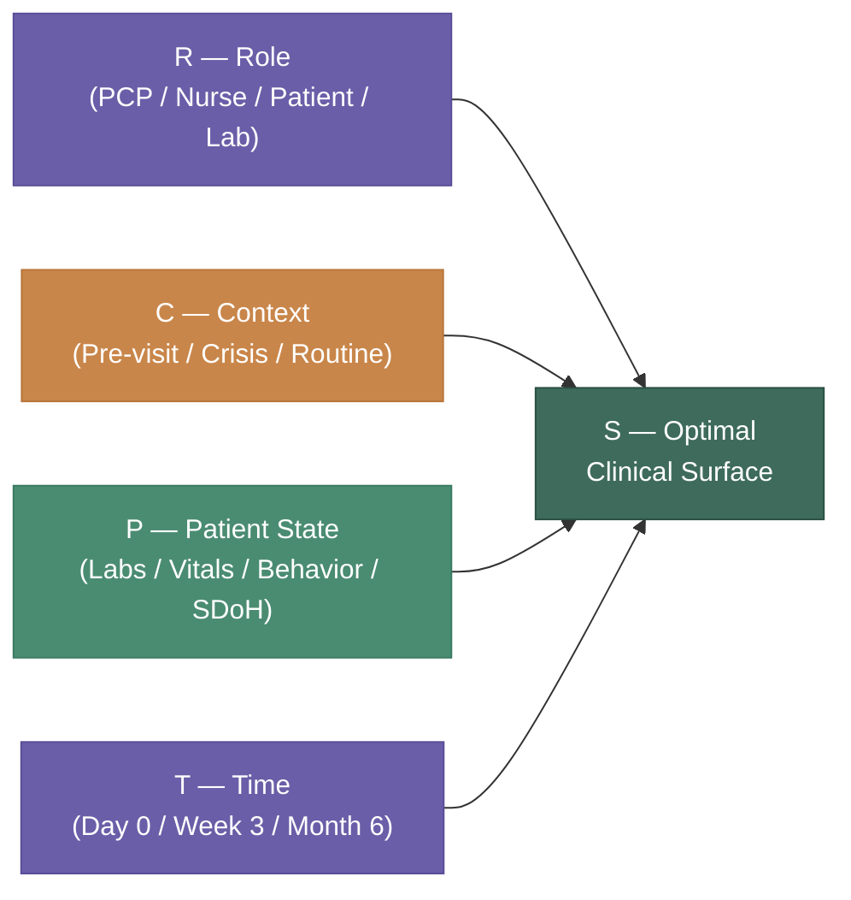
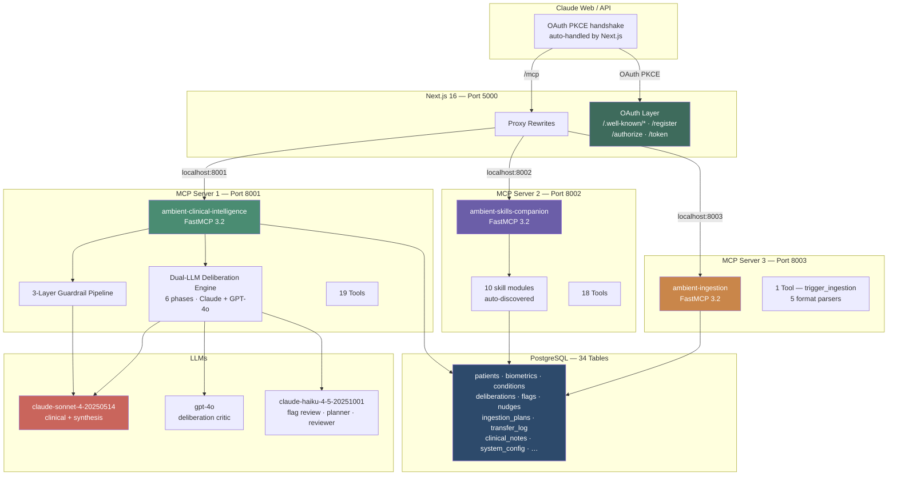
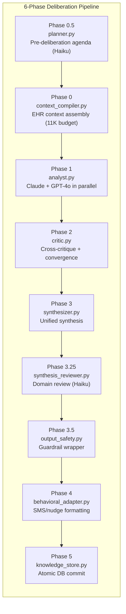
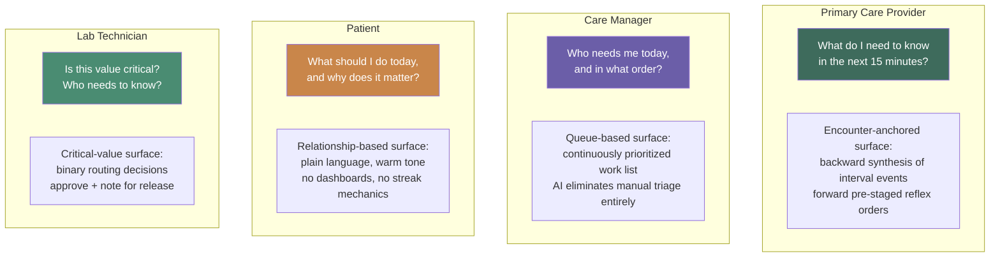
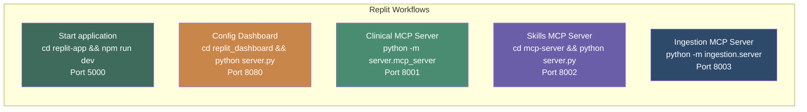

# Ambient Patient Companion

> **The interface is not designed. It is derived.**
> `S = f(R, C, P, T)`

A production multi-agent AI health system that continuously generates the optimal clinical interface as a mathematical function of four dynamic variables — Role, Context, Patient State, and Time. Built on Next.js 16, FastMCP Python servers, PostgreSQL, and the Anthropic Claude API.

---

## The Core Premise

Traditional healthcare software forces clinicians and patients to navigate static dashboards designed for a generic "average" user. The Ambient Patient Companion inverts this entirely.

```
Traditional approach:   DESIGNER → fixed UI → user adapts to it
Ambient approach:       S = f(R, C, P, T) → UI derives itself → right surface for this exact moment
```



---

## Research Foundation

This project operationalizes three peer-reviewed streams of research:

| Paper | Key Finding | Applied As |
|-------|-------------|------------|
| *AI Healthcare UX — Ambient Action Model* | LLM interfaces should emerge from context like a coding assistant, not be statically designed | The `S=f(R,C,P,T)` formula drives every UI surface |
| *AI for Holistic Primary Care* | AI-driven "chase lists" cut acute medical events by **22.9%** and hospitalizations by **48.3%** | `compute_provider_risk` + `run_crisis_escalation` skills |
| *EAGLE Trial (22,000 patients)* | AI on routine ECGs increased low-ejection-fraction diagnosis by **32%**, reducing mortality | Biometric monitoring + screening gap detection |
| *JMIR Alert Fatigue Review* | Clinicians get **56 alerts/day**, spend **49 min** on async notifications; overrides increase with volume | Action-first notification architecture, no accumulating badges |
| *Lumeris "Tom" Agent* | 50 AI touches over 6 months reduces required physician visits from 5/year to 2/year | Continuous check-in + behavioral nudge pipeline |

---

## System Architecture



---

## Three MCP Servers

### Server 1 — `ambient-clinical-intelligence` · `server/mcp_server.py`

The primary clinical intelligence layer. Every AI call passes through a three-layer guardrail pipeline. Also hosts the HealthEx ingestion pipeline, Dual-LLM Deliberation Engine, and Flag Lifecycle system.

```
Public URL: https://[your-replit-domain]/mcp

Guardrail Pipeline:
  Layer 1 — Input:      PHI detection · jailbreak blocking · scope check · emotional tone flag
  Layer 2 — Escalation: life-threatening · controlled substances · pediatric · pregnancy
  Layer 3 — Output:     citation check · PHI leakage scan · diagnostic language flags · drug grounding
```

| Tool | Description | REST |
|------|-------------|------|
| `clinical_query` | 3-layer guardrail → Claude Sonnet → validated response | `POST /tools/clinical_query` |
| `get_guideline` | Fetch ADA/USPSTF guideline by ID (e.g., `9.1a`) | `GET /tools/get_guideline` |
| `check_screening_due` | Overdue USPSTF screenings for patient profile | `POST /tools/check_screening_due` |
| `flag_drug_interaction` | Known drug interactions from clinical rules | `POST /tools/flag_drug_interaction` |
| `get_synthetic_patient` | Demo patient from live DB (MRN 4829341) | `GET /tools/get_synthetic_patient` |
| `use_healthex` | Switch data track to HealthEx real records | `POST /tools/use_healthex` |
| `use_demo_data` | Switch data track to Synthea demo data | `POST /tools/use_demo_data` |
| `switch_data_track` | Switch to named track (synthea/healthex/auto) | `POST /tools/switch_data_track` |
| `get_data_source_status` | Report active track + available sources | `GET /tools/get_data_source_status` |
| `register_healthex_patient` | Create/upsert HealthEx patient row, return UUID | `POST /tools/register_healthex_patient` |
| `ingest_from_healthex` | Two-phase ingest: plan (fast) + execute (write rows) | `POST /tools/ingest_from_healthex` |
| `execute_pending_plans` | Re-execute failed/pending ingestion plans | `POST /tools/execute_pending_plans` |
| `get_ingestion_plans` | Read plan summaries + insights_summary | `POST /tools/get_ingestion_plans` |
| `get_transfer_audit` | Per-record transfer_log audit trail | `POST /tools/get_transfer_audit` |
| `run_deliberation` | Dual-LLM deliberation (progressive or full mode) | `POST /tools/run_deliberation` |
| `get_deliberation_results` | Retrieve stored deliberation outputs | `POST /tools/get_deliberation_results` |
| `get_flag_review_status` | Flag lifecycle status (open/retracted/pending human review) | `POST /tools/get_flag_review_status` |
| `get_patient_knowledge` | Accumulated patient-specific knowledge | `POST /tools/get_patient_knowledge` |
| `get_pending_nudges` | Queued nudges for delivery scheduling | `POST /tools/get_pending_nudges` |

### Server 2 — `ambient-skills-companion` · `mcp-server/server.py`

18 clinical skills auto-discovered from `mcp-server/skills/` via a `register(mcp)` convention.

```
Public URL: https://[your-replit-domain]/mcp-skills
```



```mermaid
graph LR
    subgraph "ambient-skills-companion — 18 tools"
        A["compute_obt_score<br/>Optimal Being Trajectory"]
        B["compute_provider_risk<br/>Chase list score"]
        C["run_crisis_escalation<br/>Behavioral crisis detection"]
        D["run_food_access_nudge<br/>End-of-month SDoH trigger"]
        E["generate_daily_checkins<br/>Idempotent check-in seed"]
        F["generate_patient<br/>FHIR bundle → PostgreSQL"]
        G["generate_daily_vitals<br/>Biometric reading seed"]
        H["generate_previsit_brief<br/>Pre-encounter synthesis"]
        I["run_sdoh_assessment<br/>Social determinants"]
        J["Data track tools (8)<br/>freshness · ingestion · conflicts<br/>source status · healthex · demo data"]
    end

    style A fill:#6B5EA8,color:#fff
    style B fill:#6B5EA8,color:#fff
    style C fill:#c9655c,color:#fff
    style D fill:#4A8C72,color:#fff
    style H fill:#C9864A,color:#fff
    style J fill:#2d4a6b,color:#fff
```

### Server 3 — `ambient-ingestion` · `ingestion/server.py`

```
Public URL: https://[your-replit-domain]/mcp-ingestion

trigger_ingestion(patient_id, source, force_refresh)
  Full ETL pipeline: FHIR parse → conflict detection → upsert → freshness log
  Adapters: synthea (demo) | healthex (real records)
  Format parsers: A (plain text) · B (compressed table) · C (flat FHIR text) · D (FHIR JSON) · JSON-dict
```

---

## Connecting Claude

All three servers require OAuth PKCE before connecting. The flow completes automatically — no login screen because this is a public server. Claude handles the handshake invisibly.

**To add to Claude:** Settings → Integrations → Add custom integration → paste URL below → done.

| Server | URL |
|--------|-----|
| `ambient-clinical-intelligence` | `https://[your-replit-domain]/mcp` |
| `ambient-skills-companion` | `https://[your-replit-domain]/mcp-skills` |
| `ambient-ingestion` | `https://[your-replit-domain]/mcp-ingestion` |

The OAuth discovery endpoints are served by Next.js:

| Endpoint | RFC | Purpose |
|---|---|---|
| `GET /.well-known/oauth-protected-resource` | RFC 9728 | Declares auth server — prevents "server sleeping" error |
| `GET /.well-known/oauth-authorization-server` | RFC 8414 | Lists token/register/authorize endpoints |
| `POST /register` | RFC 7591 | Issues `client_id` to Claude |
| `GET /authorize` | RFC 6749 | Auto-issues authorization code |
| `POST /token` | RFC 6749 | Returns Bearer token |

---

## Dual-LLM Deliberation Engine

An async pre-computation pipeline where Claude Sonnet and GPT-4o independently analyze a patient's clinical context, cross-critique each other, then synthesize into 5 structured output categories.



**5 output categories** (from synthesis): clinical_findings · medication_review · care_gaps · behavioral_insights · care_coordination_actions

**Flag Lifecycle**: deliberation results are screened by `flag_reviewer.py` (Haiku). Flags with `had_zero_values=True` or `requires_human=True` are held for human review before activation.

---

## Database Schema — 34 Tables


**Table groups:**
- **Base schema** (22 tables): `patients`, `patient_conditions`, `patient_medications`, `biometric_readings`, `daily_checkins`, `obt_scores`, `provider_risk_scores`, `sdoh_assessments`, `care_gaps`, `ingestion_log`, `source_freshness`, `system_config` + 10 more
- **Deliberation** (4 tables): `deliberations`, `deliberation_outputs`, `patient_knowledge`, `core_knowledge_updates`
- **Flag lifecycle** (3 tables): `deliberation_flags`, `flag_review_runs`, `flag_corrections`
- **Ingestion** (4 tables): `ingestion_plans`, `transfer_log`, `clinical_notes`, `media_references`
- **System**: `system_config` (data track, model, dashboard state)

---

## Four Interaction Contracts

The `S=f(R,C,P,T)` formula produces four distinct interaction patterns:



---

## Alert Fatigue — The Clinical Research Problem

```
📖 JMIR Systematic Review, 2021
   → 56 alerts/day per clinician
   → 49 minutes spent on async notifications
   → Override rates increase as volume increases

📖 AMIA Conference, 2019 (4 health systems)
   → 1/3 of medication alerts are repeats from same patient, same year

📖 BMC Medical Informatics, 2017
   → Two distinct fatigue mechanisms:
     (A) Cognitive overload from volume
     (B) Desensitization from repetition
```

**Design response — Action-First Architecture:**

```
Every card must result in action or be dismissed.
No "read" state.   No history.   No accumulating badge.
The feed empties as you work. When empty: "All caught up."
```

---

## AI Escalation Design

A key demonstration: **the AI's value is sometimes in what it refuses to answer.**

```
Normal flow:
  Patient asks about stress → BP relationship     ← AI answers
  Patient asks about Tuesday's reading (148/91)   ← AI answers

Escalation trigger:
  Patient: "My head hurts — adjust my pill?"

  Instead of answering:
  ┌─────────────────────────────────────────────────────┐
  │  This question needs your care team.                │
  │                                                     │
  │  ✶ AI stopped here · Handing off                   │
  │                                                     │
  │  Questions about adjusting medication — especially  │
  │  with a headache — aren't something I can advise   │
  │  on safely.                                         │
  │                                                     │
  │  [Alert care team now]   [Save for next visit]     │
  └─────────────────────────────────────────────────────┘
```

The escalation is not a failure state. It is the system working exactly as intended.

---

## Workflows (5 active)



`start.sh` is the production entry point. It calls `scripts/generate_mcp_json.py` first to regenerate `.mcp.json` with the correct public HTTPS URLs from `$REPLIT_DEV_DOMAIN`, then starts all 5 services.

---

## Test Coverage — ~670 tests

```
┌────────────────────────────────────────┬────────┬───────────┐
│ Suite                                  │ Tests  │ Framework │
├────────────────────────────────────────┼────────┼───────────┤
│ Phase 1 Clinical Intelligence          │  196   │ pytest    │
│ Phase 2 Deliberation + Flags           │   95   │ pytest    │
│ Deliberation Engine Unit               │  109   │ pytest    │
│ Ingestion Pipeline                     │  152   │ pytest    │
│ Skills MCP Backend                     │   92   │ pytest    │
│ End-to-End MCP Use-Cases               │   28   │ pytest    │
│ MCP Smoke Tests                        │   24   │ pytest    │
│ MCP Discovery + OAuth (DN-1–DN-26)     │   26   │ pytest    │
│ Frontend (Next.js)                     │   37   │ Jest      │
│ Config Dashboard                       │   30   │ anyio     │
└────────────────────────────────────────┴────────┴───────────┘
```

```bash
python -m pytest tests/phase1/ -v
python -m pytest tests/phase2/ -v
python -m pytest server/deliberation/tests/ -v
python -m pytest ingestion/tests/ -v
python -m pytest tests/e2e/ -v
python -m pytest tests/test_mcp_discovery.py -v   # DN-1 to DN-26
cd mcp-server && python -m pytest tests/ -v
cd replit-app && npm test
cd replit_dashboard && python -m pytest tests/ -v
```

---

## Project Structure

```
ambient-patient-companion/
│
├── replit-app/                  Next.js 16 frontend (port 5000)
│   ├── next.config.ts           Proxy rewrites → 3 MCP servers
│   ├── lib/oauth-store.ts       In-memory OAuth client/code/token store
│   ├── app/
│   │   ├── .well-known/         OAuth discovery (RFC 9728 + RFC 8414)
│   │   ├── authorize/           Authorization code grant (auto-issues)
│   │   ├── token/               Token exchange
│   │   ├── register/            Dynamic client registration (RFC 7591)
│   │   └── api/                 patients · vitals · checkin · obt · mcp · sse
│   └── components/
│       └── PatientManager.tsx   Patient CRUD (search · add · edit · delete)
│
├── server/                      Server 1: ambient-clinical-intelligence (port 8001)
│   ├── mcp_server.py            FastMCP: 19 tools + REST wrappers + /health
│   ├── guardrails/              input_validator · output_validator · clinical_rules
│   └── deliberation/            Dual-LLM Deliberation Engine (6 phases)
│       ├── engine.py            Phase orchestrator
│       ├── planner.py           Phase 0.5: agenda builder (Haiku)
│       ├── context_compiler.py  Phase 0: EHR context assembly
│       ├── analyst.py           Phase 1: parallel Claude + GPT-4o
│       ├── critic.py            Phase 2: cross-critique
│       ├── synthesizer.py       Phase 3: unified synthesis
│       ├── synthesis_reviewer.py Phase 3.25: domain review (Haiku)
│       ├── output_safety.py     Phase 3.5: guardrail wrapper
│       ├── behavioral_adapter.py Phase 4: nudge formatting
│       ├── knowledge_store.py   Phase 5: DB commit
│       ├── flag_reviewer.py     LLM flag lifecycle review (Haiku)
│       └── flag_writer.py       Flag registry writes
│
├── mcp-server/                  Server 2: ambient-skills-companion (port 8002)
│   ├── server.py                FastMCP: auto-discovers skills (18 tools)
│   ├── skills/                  10 skill modules
│   ├── db/schema.sql            22-table base schema (source of truth)
│   └── transforms/              FHIR-to-schema transformers
│
├── ingestion/                   Server 3: ambient-ingestion (port 8003)
│   ├── server.py                FastMCP: trigger_ingestion tool
│   ├── pipeline.py              ETL orchestrator
│   └── adapters/healthex/       5-format adaptive parser + audit trail
│
├── replit_dashboard/            Config Dashboard (port 8080)
├── scripts/
│   └── generate_mcp_json.py     Regenerates .mcp.json from $REPLIT_DEV_DOMAIN
├── tests/
│   ├── phase1/                  196 Phase 1 tests
│   ├── phase2/                  95 Phase 2 tests
│   ├── e2e/                     28 end-to-end tests
│   ├── test_mcp_smoke.py        24 MCP smoke tests
│   └── test_mcp_discovery.py    26 discovery + OAuth tests (DN-1–DN-26)
├── .mcp.json                    MCP client discovery (auto-regenerated at startup)
├── start.sh                     Production startup script
├── config/system_prompts/       Role-based prompts (pcp · care_manager · patient)
├── shared/claude-client.js      Shared JS MCP client
├── prototypes/                  4 HTML proof-of-concept prototypes
└── submission/README.md         MCP marketplace submission
```
