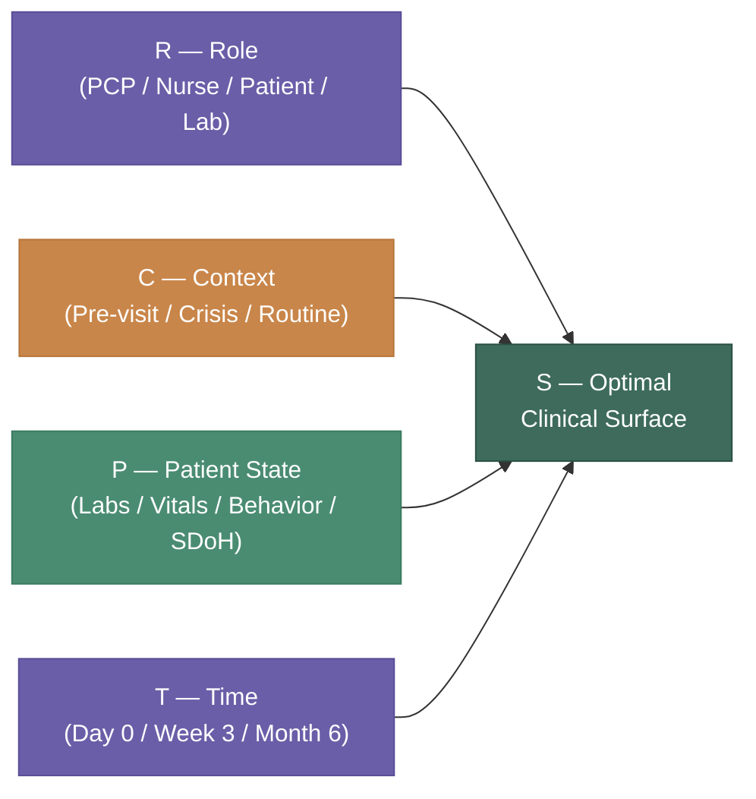
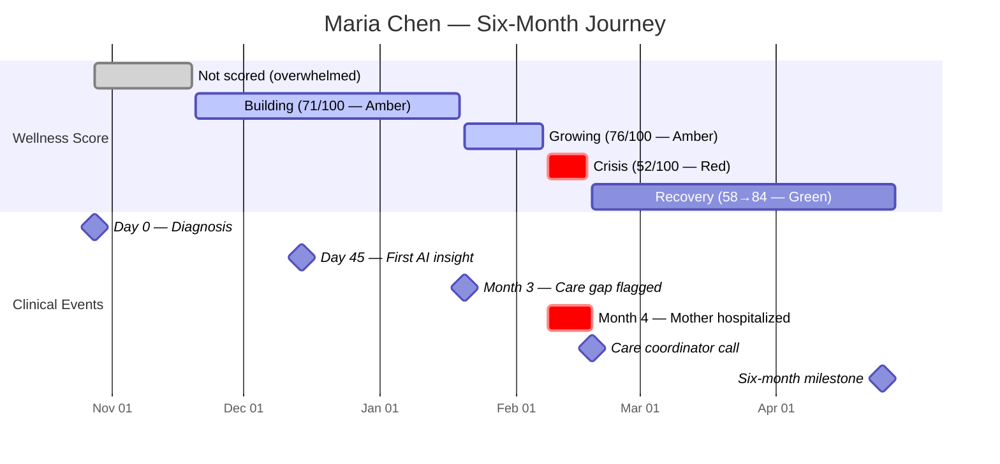
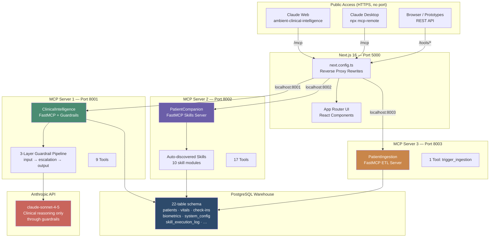
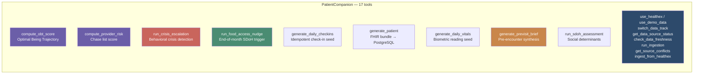
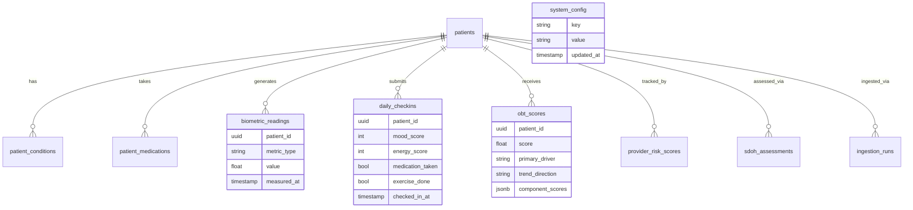
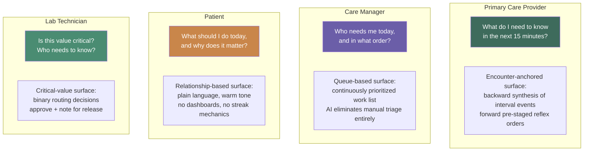
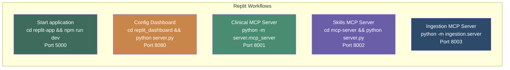
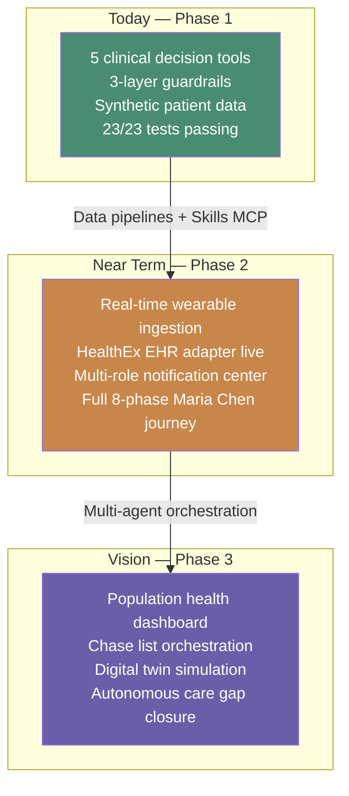

# Ambient Patient Companion

> **The interface is not designed. It is derived.**
> `S = f(R, C, P, T)`

A production multi-agent AI health system that continuously generates the optimal clinical interface as a mathematical function of four dynamic variables — Role, Context, Patient State, and Time. Built on Next.js 16, FastMCP Python servers, PostgreSQL, and the Anthropic Claude API.

---

## The Core Premise

Traditional healthcare software forces clinicians and patients to navigate static dashboards designed for a generic "average" user. The Ambient Patient Companion inverts this entirely.

```
Traditional approach:   DESIGNER → fixed UI → user adapts to it
Ambient approach:       S = f(R, C, P, T) → UI derives itself → right surface for this exact moment
```



---

## Research Foundation

This project operationalizes three peer-reviewed streams of research:

| Paper | Key Finding | Applied As |
|-------|-------------|------------|
| *AI Healthcare UX — Ambient Action Model* | LLM interfaces should emerge from context like a coding assistant, not be statically designed | The `S=f(R,C,P,T)` formula drives every UI surface |
| *AI for Holistic Primary Care* | AI-driven "chase lists" cut acute medical events by **22.9%** and hospitalizations by **48.3%** | `compute_provider_risk` + `run_crisis_escalation` skills |
| *EAGLE Trial (22,000 patients)* | AI on routine ECGs increased low-ejection-fraction diagnosis by **32%**, reducing mortality | Biometric monitoring + screening gap detection |
| *JMIR Alert Fatigue Review* | Clinicians get **56 alerts/day**, spend **49 min** on async notifications; overrides increase with volume | Action-first notification architecture, no accumulating badges |
| *Lumeris "Tom" Agent* | 50 AI touches over 6 months reduces required physician visits from 5/year to 2/year | Continuous check-in + behavioral nudge pipeline |

---

## The Patient: Maria Chen

All prototypes and clinical scenarios are built around a single canonical patient — Maria Chen — whose six-month journey provides the continuous data substrate the system needs to demonstrate emergent intelligence.

```
Maria Chen, 54
├── Type 2 Diabetes Mellitus  — HbA1c 7.8% at intake
├── Hypertension              — baseline BP 141/86 mmHg
├── Generalized Anxiety Disorder
└── Hypothyroidism
    Care setting: Patel Family Medicine
    Companion start: October 28, 2025
```

### Six-Month Clinical Arc



| Phase | Date | Wellness | What the AI does |
|-------|------|----------|-----------------|
| **Day 0** | Oct 28 | — | Welcome only. No data yet. No tracking. |
| **Week 3** | Nov 20 | Building | First morning check-in flow. 4 emoji-tap questions. Baseline dots. |
| **Day 45** | Dec 14 | 71 Amber | Wellness Ring debuts. "One Big Thing." First AI insight surfaces. |
| **Full Day** | Dec 16 | 71 Amber | Stress → BP correlation confirmed. Embedded chat. Escalation demo. |
| **Growing** | Jan 20 | 76 Amber | End-of-month glucose alert. Care gap proactive flag. |
| **Crisis** | Feb 8 | 58 Red | Mother hospitalized. Minimal UI. Companion just present. |
| **Care Response** | Feb 18 | 52 Red | Invisible 7-day behavioral signal triggers care coordinator call. |
| **6 Months** | Apr 25 | 84 Green | HbA1c 7.1%, BP 133/82, PHQ-9 down 8 points. Pre-visit brief ready. |

**Outcomes at 6 months:** HbA1c 7.8% → 7.1% · BP 141/86 → 133/82 · 76% check-in adherence · PHQ-9 down 8 points

---

## System Architecture



---

## Three MCP Servers

### Server 1 — ClinicalIntelligence `server/mcp_server.py`

The primary clinical intelligence layer. Every AI call passes through a three-layer guardrail pipeline before touching the Anthropic API.

```
/mcp  →  http://localhost:8001/mcp

Guardrail Pipeline:
  Layer 1 — Input:      PHI detection · jailbreak blocking · scope check · emotional tone flag
  Layer 2 — Escalation: life-threatening · controlled substances · pediatric · pregnancy
  Layer 3 — Output:     citation check · PHI leakage scan · diagnostic language flags · drug grounding
```

| Tool | Description | Public REST |
|------|-------------|-------------|
| `clinical_query` | 3-layer guardrail → Claude → validated response | `POST /tools/clinical_query` |
| `get_guideline` | Fetch ADA/USPSTF guideline by ID (e.g., `9.1a`) | `GET /tools/get_guideline` |
| `check_screening_due` | Overdue USPSTF screenings for patient profile | `POST /tools/check_screening_due` |
| `flag_drug_interaction` | Known drug interactions from clinical rules | `POST /tools/flag_drug_interaction` |
| `get_synthetic_patient` | Maria Chen demo patient (MRN 4829341) | `GET /tools/get_synthetic_patient` |
| `use_healthex` | Switch data track to HealthEx real records | `POST /tools/use_healthex` |
| `use_demo_data` | Switch data track to Synthea demo data | `POST /tools/use_demo_data` |
| `switch_data_track` | Switch to named track (synthea/healthex/auto) | `POST /tools/switch_data_track` |
| `get_data_source_status` | Report active track + available sources | `GET /tools/get_data_source_status` |

### Server 2 — PatientCompanion `mcp-server/server.py`

All 17 clinical skills are auto-discovered from `mcp-server/skills/` via a `register(mcp)` convention.

```
/mcp-skills  →  http://localhost:8002/mcp
```



### Server 3 — PatientIngestion `ingestion/server.py`

```
/mcp-ingestion  →  http://localhost:8003/mcp

trigger_ingestion(patient_id, source, force_refresh)
  Runs full ETL pipeline: FHIR parse → conflict detection → upsert → freshness log
  Adapters: synthea (demo) | healthex (real records)
```

---

## Public URLs

All three servers are proxied through Next.js — no port number required in any URL.

| Connector Name | URL | Tools |
|---------------|-----|-------|
| `ambient-clinical-intelligence` | `https://[your-domain]/mcp` | 9 |
| `ambient-skills-companion` | `https://[your-domain]/mcp-skills` | 17 |
| `ambient-ingestion` | `https://[your-domain]/mcp-ingestion` | 1 |

To add to Claude Web: **Settings → Integrations → Add custom integration** — paste URL, set name, done.

---

## Database Schema

22-table PostgreSQL warehouse. All data is FK-constrained.



**Key constraints:**
- `biometric_readings` has UNIQUE index on `(patient_id, metric_type, measured_at)` — idempotent upserts
- `is_stale` in `source_freshness` is a regular boolean (not generated — asyncpg compatibility)
- All date arithmetic pre-computed in Python before asyncpg calls (no `$N + INTERVAL` syntax)

---

## Four Interaction Contracts

The `S=f(R,C,P,T)` formula produces four distinct interaction patterns, each with a completely different primary question:



---

## Alert Fatigue — The Clinical Research Problem

The notification architecture was built in direct response to a documented crisis:

```
📖 JMIR Systematic Review, 2021
   → 56 alerts/day per clinician
   → 49 minutes spent on async notifications
   → Override rates increase as volume increases

📖 AMIA Conference, 2019 (4 health systems)
   → 1/3 of medication alerts are repeats from same patient, same year
   → Top 17 alerts at one institution = 1.7 million firings/month

📖 BMC Medical Informatics, 2017
   → Two distinct fatigue mechanisms:
     (A) Cognitive overload from volume
     (B) Desensitization from repetition
   → Volume reduction alone is insufficient
```

**The design response — Action-First Architecture:**

```
Every card must result in action or be dismissed.
No "read" state.   No history.   No accumulating badge.
The feed empties as you work. When empty: "All caught up."
```

| Alert Right | Applied as |
|-------------|-----------|
| Right information | Only actionable clinical signals — no FYI alerts |
| Right person | Routed by persona — nurse never sees lab QC alerts |
| Right format | AI summary in plain language, action UI matched to cognitive load |
| Right channel | Pull surface, not push interruption — clinicians come to it |
| Right time | Critical → care gaps → routine (strict priority ordering) |

---

## AI Escalation Design

A key demonstration in the prototype: **the AI's value is sometimes in what it refuses to answer.**

```
Normal flow:
  Maria asks about stress → BP relationship     ← AI answers
  Maria asks about Tuesday's reading (148/91)   ← AI answers
  Maria asks if twice-daily breathing helps     ← AI answers

Escalation trigger:
  Maria: "My head hurts — adjust my pill?"

  Instead of answering:
  ┌─────────────────────────────────────────────────────┐
  │  This question needs your care team.                │
  │                                                     │
  │  ✶ AI stopped here · Handing off                   │
  │                                                     │
  │  Questions about adjusting medication — especially  │
  │  with a headache — aren't something I can advise   │
  │  on safely.                                         │
  │                                                     │
  │  [Alert care team now]   [Save for next visit]     │
  └─────────────────────────────────────────────────────┘
```

The escalation is not a failure state. It is the system working exactly as intended.

---

## Workflows (5 active)



---

## Test Coverage

```
Total: 231 tests — all passing

┌────────────────────────────────────┬────────┬───────────┐
│ Suite                              │ Tests  │ Framework │
├────────────────────────────────────┼────────┼───────────┤
│ Phase 1 Clinical Intelligence      │ 100    │ pytest    │
│ Backend MCP Skills                 │  48    │ pytest    │
│ Frontend (Next.js)                 │  37    │ Jest      │
│ Config Dashboard                   │  30    │ anyio     │
│ End-to-End MCP use-cases           │  15    │ pytest    │
│ Public URL live verification       │  23/23 │ custom    │
└────────────────────────────────────┴────────┴───────────┘
```

```bash
# Run all suites
python -m pytest tests/phase1/ -v           # 100 Phase 1 tests
python -m pytest tests/e2e/ -v              # 15 end-to-end tests
cd mcp-server && pytest tests/ -v          # 48 backend skills tests
cd replit-app && npm test                  # 37 frontend tests
cd replit_dashboard && python -m pytest    # 30 dashboard tests
```

---

## Project Structure

```
ambient-patient-companion/
│
├── replit-app/                  Next.js 16 frontend (port 5000)
│   ├── next.config.ts           Proxy rewrites → 3 MCP servers
│   ├── app/                     App Router pages + API routes
│   └── components/              React UI components
│
├── server/                      Server 1: ClinicalIntelligence (port 8001)
│   ├── mcp_server.py            FastMCP: 9 tools + REST wrappers
│   └── guardrails/              input_validator · output_validator · clinical_rules
│
├── mcp-server/                  Server 2: PatientCompanion (port 8002)
│   ├── server.py                FastMCP: auto-discovers all skills
│   ├── skills/                  10 skill modules, each with register(mcp)
│   │   ├── compute_obt_score.py
│   │   ├── generate_patient.py
│   │   ├── generate_vitals.py
│   │   ├── generate_checkins.py
│   │   ├── compute_provider_risk.py
│   │   ├── crisis_escalation.py
│   │   ├── sdoh_assessment.py
│   │   ├── previsit_brief.py
│   │   ├── food_access_nudge.py
│   │   └── ingestion_tools.py
│   ├── db/schema.sql            22-table PostgreSQL schema (source of truth)
│   ├── seed.py                  Seed: python mcp-server/seed.py --patients 10
│   └── tests/                   48 backend tests (pytest)
│
├── ingestion/                   Server 3: PatientIngestion (port 8003)
│   ├── server.py                FastMCP: trigger_ingestion tool
│   ├── pipeline.py              ETL pipeline orchestrator
│   └── adapters/                synthea.py · healthex.py
│
├── replit_dashboard/            Config Dashboard (port 8080)
│   ├── server.py                FastAPI: 18 env keys + Claude config download
│   ├── index.html               Single-page dashboard UI
│   └── tests/                   30 dashboard tests
│
├── tests/
│   ├── phase1/                  100 Phase 1 integration tests
│   └── e2e/                     15 end-to-end MCP use-case tests
│
├── config/system_prompts/       Role-based prompts (pcp · care_manager · patient)
├── shared/claude-client.js      Shared JS MCP client
├── prototypes/                  4 HTML proof-of-concept prototypes
├── requirements.txt             Python deps (pytest-asyncio==0.21.2 pinned)
└── start.sh                     Production startup script
```

---

## Design Principles

Three principles flow directly from `S=f(R,C,P,T)` and are applied consistently across every component:

**1. Cognitive simplicity over data richness**
Showing less is an active design decision, not a limitation. The patient surface never shows a dashboard. The clinical surface never shows an unfiltered feed.

**2. Trust earned through consistency**
The companion earns the right to surface insights only after 45 days of data collection. The AI never claims certainty it does not have, and shows confidence scores where relevant.

**3. Goal is health identity, not engagement**
The prototype deliberately avoids streak mechanics, notification floods, and gamification. The patient's goal is to understand themselves, not to use an app.

**What was explicitly not built:**
- No health dashboards (aggregated metrics create anxiety without agency)
- No daily notification floods (every notification must be actionable by definition)
- No streak mechanics (a missed day is information, not failure)
- No autonomous AI interventions (AI surfaces patterns; humans make decisions)
- No clinical jargon on the patient surface

---

## Environment Variables

| Key | Source | Notes |
|-----|--------|-------|
| `ANTHROPIC_API_KEY` | Replit Secret | Used by ClinicalIntelligence server only |
| `DATABASE_URL` | Auto (Replit PostgreSQL) | Used by all 3 MCP servers |
| `LANGSMITH_API_KEY` | Replit Secret | Optional tracing |
| `MCP_TRANSPORT` | Workflow env | `streamable-http` for all 3 servers |
| `MCP_PORT` | Workflow env | 8001 / 8002 / 8003 |
| `CLAUDE_MODEL` | Auto | Default: `claude-sonnet-4-5` |

Config Dashboard at port 8080 manages all 18 keys across three categories (AUTO / SELF_HOSTED / THIRD_PARTY).

---

## Seeding Data

```bash
# Generate minimal Synthea FHIR fixtures first
python mcp-server/scripts/create_minimal_fixtures.py

# Seed database: 10 patients, 6 months of history each
python mcp-server/seed.py --patients 10 --months 6
```

---

## Quick Start

```bash
# Install Python dependencies
pip install -r requirements.txt

# Install frontend dependencies
cd replit-app && npm ci

# Seed the database
python mcp-server/seed.py --patients 5 --months 3

# All 5 workflows start automatically via Replit
# Or manually:
MCP_TRANSPORT=streamable-http MCP_PORT=8001 python -m server.mcp_server &
cd mcp-server && MCP_TRANSPORT=streamable-http MCP_PORT=8002 python server.py &
MCP_TRANSPORT=streamable-http MCP_PORT=8003 python -m ingestion.server &
cd replit_dashboard && python server.py &
cd replit-app && npm run dev
```

---

## Key Engineering Rules

- **asyncpg**: Never use `$N + INTERVAL '1 day'` — pre-compute date bounds in Python
- **MCP skills**: Never use `print()` — all logging goes to `sys.stderr`
- **pytest-asyncio**: Pinned to `0.21.2` — version 1.x breaks session-scoped `event_loop`
- **Model name**: `claude-sonnet-4-5` (hardcoded; verified by 100 Phase 1 tests)
- **Guardrails**: `clinical_query` is the only tool that calls the Anthropic API — all others are deterministic
- **Data tracks**: `use_healthex()` / `use_demo_data()` return plain strings, not JSON; `get_data_source_status()` returns JSON

---

## The Broader Vision



The long-term goal is a system where a single care manager, augmented by the PatientCompanion AI agent network, can safely manage a patient panel **5 to 10 times larger** than what is currently possible — not by eliminating the human relationship, but by eliminating the friction that prevents it.

---

*Built at Patel Family Medicine · Ambient Action Model Project · April 2026*
